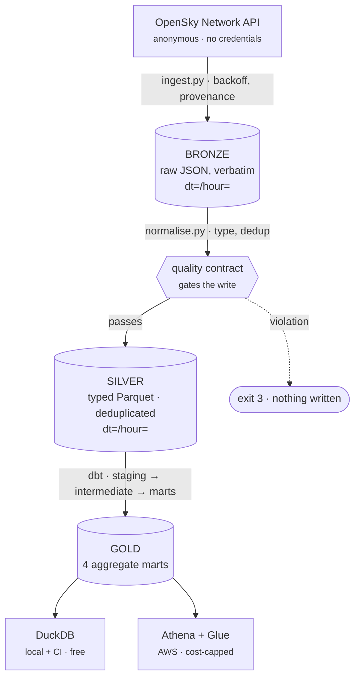

# flightops-lakehouse

[](https://github.com/JohnNessime/flightops-lakehouse/actions/workflows/ci.yml)
[](https://github.com/JohnNessime/flightops-lakehouse/actions/workflows/security.yml)
[](LICENSE)
[](pyproject.toml)

A production-shaped **lakehouse on AWS** built over live flight telemetry, whose
entire transformation layer runs and is tested **with no AWS account, no
credentials and no cloud spend**. The same dbt models execute on DuckDB locally
and on Athena in the cloud — one model codebase, two adapters, and not a single
engine conditional in any model. CI proves the whole pipeline on every push
while remaining structurally incapable of authenticating to AWS.

It demonstrates the parts of data engineering that are usually invisible in a
portfolio: cost decisions with the arithmetic shown, a schema treated as a
contract rather than something to be inferred, and guarantees enforced by tests
that fail rather than by claims in a README.

---

## Architecture



Deeper detail in [docs/ARCHITECTURE.md](docs/ARCHITECTURE.md).

---

## Run it locally in 5 minutes

No AWS account. No credentials. No network call.

```bash
make install
make pipeline
```

That installs the package, replays six committed OpenSky snapshots into bronze,
normalises them to typed Parquet behind a quality contract, and builds every dbt
model and test on DuckDB. Real output from a clean run:

```
flightops.ingest    replayed fixtures into bronze [fixtures=6 objects=6]
flightops.normalise normalised bronze objects [duplicates_removed=78 rows_in=896 rows_out=818]
flightops.quality   quality check complete [result=818 rows, 0 violation(s), 2 warning(s)]
flightops.normalise wrote silver partition [dt=2026-08-25/hour=09 rows=400]
flightops.normalise wrote silver partition [dt=2026-08-25/hour=10 rows=418]

Finished running 1 seed, 4 table models, 50 data tests, 2 view models
Done. PASS=57 WARN=0 ERROR=0 SKIP=0
```

Then query it:

```bash
duckdb data/flightops.duckdb -c "SELECT * FROM mart_country_hourly_activity ORDER BY aircraft_count DESC LIMIT 5"
```

To pull a live snapshot instead of replaying fixtures: `make ingest`.

| Command | What it does |
| --- | --- |
| `make check` | ruff + the full test suite |
| `make pipeline` | ingest → normalise → dbt build |
| `make ci` | exactly what CI runs |
| `make tf` | terraform fmt, validate, tflint, checkov |
| `make audit` | dependency CVE audit |
| `make security` | gitleaks over the working tree and full history |

---

## What this actually demonstrates

**One dbt codebase on two engines.** `dbt-duckdb` locally and in CI,
`dbt-athena-community` in AWS. The constraint is enforced, not aspirational: a
test fails the build if any model branches on `target.type` or uses an
engine-specific function. That is why carrier codes are extracted with `substr`
and `BETWEEN 'A' AND 'Z'` rather than one clean regex — DuckDB spells it
`regexp_matches`, Trino spells it `regexp_like`. Ugly and portable, deliberately.
→ [ADR 0001](docs/adr/0001-duckdb-and-athena-dual-adapter.md)

**Cost decisions with the arithmetic shown.** No Glue crawlers: an hourly
crawler costs roughly $13/month to rediscover a schema already declared in code
— an order of magnitude more than this project's entire bill. No NAT Gateway, at
~$32/month for the hourly charge alone. The Athena workgroup sets
`bytes_scanned_cutoff_per_query` **with `enforce_workgroup_configuration`**,
because without enforcement the cutoff is a default any client can override.
→ [docs/COSTS.md](docs/COSTS.md)

**A partitioning decision that reversed under measurement.** The design called
for partitioning silver on `dt` and `origin_country`. Building it produced a
number the original reasoning had not accounted for: **~7 rows per country
partition**. Athena bills a 10 MB minimum per query, so pruning at that scale
saves nothing while small-file overhead costs real money. `origin_country`
became an ordinary column.
→ [ADR 0003](docs/adr/0003-partitioning-strategy.md)

**A schema treated as a contract.** Quality checks run **before** the silver
write — a violation exits `3` and leaves nothing on disk, because checking
afterwards means a downstream reader finds the bad batch first. Violations and
warnings are distinguished on principle: an aircraft with no position fix is
*incomplete* and warns; one coordinate without the other is *corrupt* and fails.
A check that fires on every real batch is a check nobody reads.

**Provenance that cannot be faked.** Every bronze object records whether it came
from a live fetch or a fixture replay, and that tag is carried into silver. CI
runs on fixtures, and its data says so.

---

## Security

The repository is public and holds **no credential of any kind** — a structural
property, not a habit.

- **No long-lived AWS keys exist.** GitHub OIDC exchanges a short-lived token
  for temporary credentials. There is nothing to leak, rotate or commit.
- **CI cannot reach AWS.** No secrets, no `id-token: write`, no `aws-actions/*`,
  and the `[aws]` extra is never installed. Asserted by tests.
- **Every action is pinned to a commit SHA**, resolved from the GitHub API.
  A tag is a movable pointer; `@v7` next month can be different code.
- **The deploy role is scoped to one repository at one ref** with
  `StringEquals`, never `StringLike`. No IAM statement uses a bare resource
  wildcard.
- **The pre-commit gate demonstrably blocks**, not merely runs — verified by
  planting a live-shaped AWS key and confirming rejection.
- **Weekly scanning**, because CI answers "did this change break anything" while
  a CVE published last Tuesday breaks nothing and fails no test.

---

## Where the guarantees come from

Every claim above is enforced by something that fails:

| Guarantee | Enforced by |
| --- | --- |
| Tests never touch the network | `conftest._no_network` severs `socket.connect` |
| No model branches on the adapter | `test_no_model_branches_on_the_adapter` |
| No engine-specific SQL | `test_no_model_uses_engine_specific_regex_functions` |
| No IAM resource wildcards | `test_no_policy_statement_uses_a_bare_resource_wildcard` |
| Deploy role scoped to one repo, one ref | `test_trust_policy_pins_the_subject_with_string_equals` |
| CI cannot obtain AWS credentials | `test_no_workflow_can_obtain_aws_credentials` |
| Actions are SHA-pinned | `test_every_action_is_pinned_to_a_commit_sha` |
| Suppressions are justified | fails on a reason under 60 characters |

---

## Tech stack

| Layer | Tool |
| --- | --- |
| Ingestion | Python 3.11+, `requests` |
| Storage | Parquet (snappy), Hive partitioning, S3 |
| Transformation | dbt — `dbt-duckdb` / `dbt-athena-community` |
| Query engines | DuckDB (local), Amazon Athena (cloud) |
| Catalog | AWS Glue, declarative tables + partition projection |
| Infrastructure | Terraform, four modules |
| CI/CD | GitHub Actions, OIDC, SHA-pinned |
| Quality gates | ruff · pytest · gitleaks · tflint · checkov · pip-audit |

**196 tests, 97% coverage.** 6 dbt models, 50 dbt tests, 4 marts.
`terraform fmt`, `validate`, `tflint` and `checkov` all clean — 51 passed,
0 failed, 5 documented suppressions.

---

## Honest limitations

Stated plainly rather than implied away:

- **The Athena path is configured and reviewed, but never executed.**
  `dbt-athena-community` lives in the `[aws]` extra and is deliberately absent
  from CI, so dbt cannot even resolve that target here. What *is* verified: both
  targets are defined, the default needs no credentials, and every AWS-shaped
  value comes from `env_var` with no literal bucket or account id. Not that the
  models run on Athena.
- **The Terraform has never been applied to a real AWS account.** Static
  analysis proves the configuration *says* the right thing, not that AWS *did*
  the right thing.
- **The dataset is deliberately tiny.** Six snapshots across two hours is enough
  to demonstrate partitioning, deduplication and time-series marts. This is not
  a scale exercise, and ADR 0003's conclusion would need revisiting several
  orders of magnitude up.
- **`.terraform.lock.hcl` is gitignored**, which runs against HashiCorp's own
  recommendation. Recorded as a deliberate deviation in
  [infra/README.md](infra/README.md) rather than left to look like an oversight.

---

## Documentation

| Document | What's in it |
| --- | --- |
| [ARCHITECTURE.md](docs/ARCHITECTURE.md) | Layers, trust boundaries, where guarantees come from |
| [COSTS.md](docs/COSTS.md) | Line-by-line spend, what was avoided and why, budget alert |
| [DATA_DICTIONARY.md](docs/DATA_DICTIONARY.md) | Every column, upstream index, dedup key, contracts |
| [infra/README.md](infra/README.md) | Modules, suppressions, deploy steps |
| [ADR 0001](docs/adr/0001-duckdb-and-athena-dual-adapter.md) | Dual adapter, and what it does not prove |
| [ADR 0002](docs/adr/0002-declarative-glue-tables-over-crawlers.md) | Declarative Glue tables over crawlers |
| [ADR 0003](docs/adr/0003-partitioning-strategy.md) | Partitioning, reversed by measurement |
| [CLAUDE.md](CLAUDE.md) | The build contract this repository was developed against |

---

## Data source and licence

Telemetry from the [OpenSky Network](https://opensky-network.org/) public API,
used anonymously and within its
[terms of use](https://opensky-network.org/about/terms-of-use). The committed
fixtures are unmodified API responses, privacy-reviewed before commit — see
[tests/fixtures/README.md](tests/fixtures/README.md). `icao24` is a transponder
address broadcast openly by the aircraft; it identifies an airframe, not a
person.

Code released under the [MIT Licence](LICENSE).
