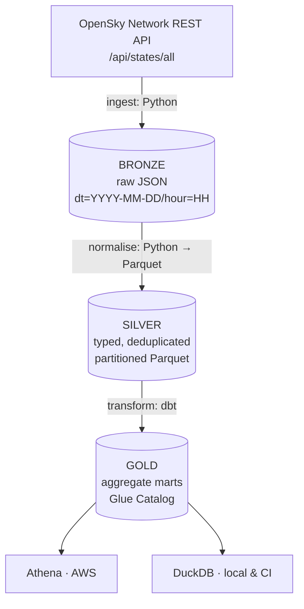

# flightops-lakehouse

A cost-safe, portfolio-grade **lakehouse on AWS** built around live flight
telemetry from the [OpenSky Network](https://opensky-network.org/) public API —
with a **fully local development and CI path**, so the entire transformation
layer runs and is tested with zero AWS credentials.

> **Status: Phase 4 of 6 — transformation.** Ingestion, the typed silver layer
> and the full dbt transformation layer are in place and green on DuckDB.
> Terraform and CI land in subsequent phases. This README is a skeleton and
> will be rewritten in Phase 6.

---

## Architecture



The central design decision: **the same dbt models run against two adapters** —
`dbt-duckdb` locally and in CI, `dbt-athena-community` in AWS. One model
codebase, two profile targets, and **not a single `` in any
model** — a test fails the build if one appears.

The Athena target is configured and reviewed but **not executed**: the adapter
lives in the `[aws]` extra and is deliberately absent from CI, so the cloud path
is proven by inspection, not by a test run. [ADR 0001](docs/adr/0001-duckdb-and-athena-dual-adapter.md)
says so plainly rather than implying both engines were exercised.

### Marts

| Mart | Grain | What it answers |
| --- | --- | --- |
| `mart_country_hourly_activity` | date · hour · country | How many distinct aircraft per country per hour |
| `mart_altitude_band_distribution` | date · hour · band | How traffic distributes across altitude bands |
| `mart_ground_activity_ratio` | date · hour · country | Airborne vs on-ground split, a proxy for airport activity |
| `mart_carrier_activity` | date · hour · carrier | Callsign-prefix rollup joined to a seeded ICAO designator reference |

### Architecture decisions

- [ADR 0001 — DuckDB and Athena dual adapter](docs/adr/0001-duckdb-and-athena-dual-adapter.md)
- [ADR 0002 — Declarative Glue tables over crawlers](docs/adr/0002-declarative-glue-tables-over-crawlers.md)
- [ADR 0003 — Partitioning strategy](docs/adr/0003-partitioning-strategy.md)

---

## Run it locally in 5 minutes

No AWS account, no credentials, no cloud spend.

```bash
make install
make check
```

That installs the package with its local + dev extras, runs `ruff`, and runs the
full test suite offline — the suite severs outbound sockets, so a test that
reaches the network fails rather than passing quietly on your machine.

To pull a live snapshot into the bronze layer:

```bash
.venv/bin/flightops ingest
```

Which lands a Hive-partitioned object and tells you exactly what it did:

```
INFO flightops.ingest fetched live snapshot [attempt=1 bytes=17998 states=140]
INFO flightops.ingest wrote bronze snapshot [path=data/bronze/dt=2026-08-25/hour=09/states_1787651200.json source=opensky-live states=140]
```

Then turn the raw snapshots into typed, deduplicated silver Parquet:

```bash
.venv/bin/flightops normalise
```

```
INFO  flightops.normalise normalised bronze objects [duplicates_removed=16 files=2 rows_in=282 rows_out=266]
INFO  flightops.quality   quality check complete [result=266 rows, 0 violation(s), 2 warning(s)]
INFO  flightops.normalise wrote silver partition [path=data/silver/dt=2026-08-25/hour=09/states.parquet rows=266]
```

The quality contract runs **before** the write. A batch that violates it exits
`3` and leaves nothing on disk — checking afterwards would leave a bad batch for
a downstream reader to find first. Column definitions, dedup key and every
contract are in [docs/DATA_DICTIONARY.md](docs/DATA_DICTIONARY.md).

Then build the gold marts with dbt, on DuckDB, with no AWS account:

```bash
make dbt-build
```

```
Finished running 1 seed, 4 table models, 50 data tests, 2 view models
Completed successfully
Done. PASS=57 WARN=0 ERROR=0 SKIP=0
```

Or run the whole pipeline in one step: `make pipeline`.

Offline, or OpenSky rate-limiting you? Replay the committed fixtures instead:

```bash
.venv/bin/flightops ingest --allow-fixture-fallback
```

The fallback is **opt-in**. A pipeline that silently substitutes demonstration
data for a failed fetch looks healthy while producing fiction, so the resulting
object is tagged `fixture-replay` rather than `opensky-live` and downstream
layers can always tell the difference.

### Configuration

Everything is environment-driven, with defaults that work on a clean checkout.

| Variable | Default | Purpose |
| --- | --- | --- |
| `FLIGHTOPS_OPENSKY_BASE_URL` | `https://opensky-network.org/api` | API root |
| `FLIGHTOPS_DATA_ROOT` | `data` | local lake root |
| `FLIGHTOPS_BRONZE_PREFIX` | `bronze` | bronze prefix under the root |
| `FLIGHTOPS_SILVER_PREFIX` | `silver` | silver prefix under the root |
| `FLIGHTOPS_BBOX_{LAMIN,LOMIN,LAMAX,LOMAX}` | unset | geographic filter; all four or none |
| `FLIGHTOPS_HTTP_TIMEOUT` | `30` | per-request timeout, seconds |
| `FLIGHTOPS_MAX_RETRIES` | `4` | retries on 429/5xx |
| `FLIGHTOPS_BACKOFF_BASE` / `_MAX` | `2` / `60` | exponential backoff bounds, seconds |
| `FLIGHTOPS_ALLOW_FIXTURE_FALLBACK` | `0` | permit fixture replay on failure |

Access is **anonymous by design**. OpenSky's OAuth2 client secret is exactly the
class of value this repository must never hold, so the ingest path is built to
need no credential at all.

---

## Cost discipline

This repository is deliberately architected to cost approximately nothing:

| Avoided | Why |
| --- | --- |
| Glue crawlers | Billed per DPU-hour with a 10-minute minimum. Tables are declared in Terraform instead. |
| Glue ETL / Spark | Ingestion is plain Python (local) or a small Lambda. |
| VPC, NAT Gateway, ECS, Redshift, MWAA, OpenSearch | S3, Glue Catalog, Athena, Lambda and Step Functions are all VPC-free. |

Athena runs behind a workgroup with `bytes_scanned_cutoff_per_query` and
`enforce_workgroup_configuration` set. S3 lifecycle rules expire bronze after
30 days and move silver/gold to Infrequent Access after 60.

Full line-by-line breakdown: `docs/COSTS.md` (Phase 2+).

---

## Tech stack

| Layer | Tool |
| --- | --- |
| Ingestion | Python 3.11+, `requests` |
| Storage format | Parquet (snappy), Hive-style partitioning |
| Transformation | dbt (`dbt-duckdb` / `dbt-athena-community`) |
| Local query engine | DuckDB |
| Cloud query engine | Amazon Athena |
| Catalog | AWS Glue Data Catalog (declarative tables) |
| Infrastructure | Terraform |
| CI/CD | GitHub Actions, OIDC (no long-lived AWS keys) |
| Quality gates | ruff, pytest, gitleaks, tflint, checkov |

---

## Repository layout

```
src/flightops/     ingestion, normalisation, quality contracts, CLI
dbt/               staging -> intermediate -> marts
infra/             Terraform: lake_storage, glue_catalog, athena, oidc_role
orchestration/     Lambda ingest + Step Functions state machine
tests/             offline unit tests and committed fixtures
docs/              architecture, costs, data dictionary, ADRs
```

---

## Licence

[MIT](LICENSE)
