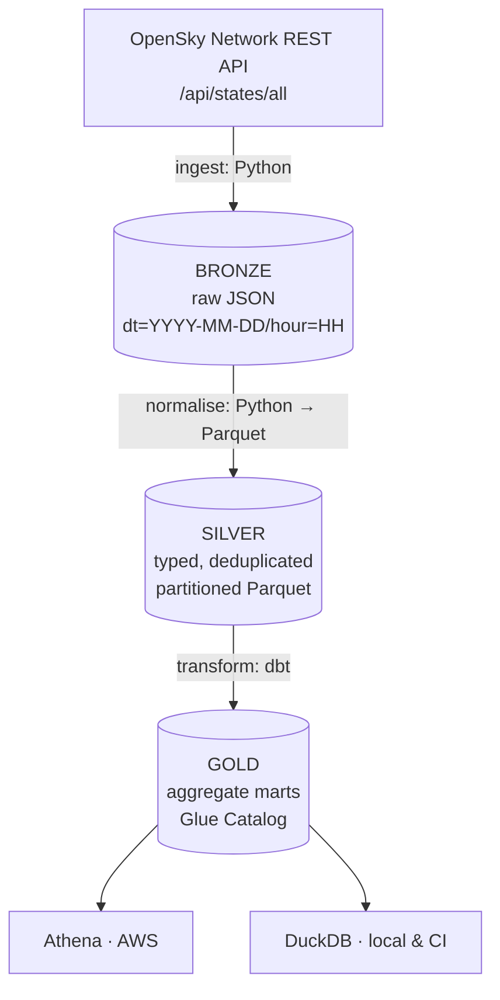

# flightops-lakehouse

A cost-safe, portfolio-grade **lakehouse on AWS** built around live flight
telemetry from the [OpenSky Network](https://opensky-network.org/) public API —
with a **fully local development and CI path**, so the entire transformation
layer runs and is tested with zero AWS credentials.

> **Status: Phase 1 of 6 — foundation.** Scaffold, security contract and
> tooling are in place. Ingestion, normalisation, dbt, Terraform and CI land in
> subsequent phases. This README is a skeleton and will be rewritten in Phase 6.

---

## Architecture



The central design decision: **the same dbt models run against two adapters** —
`dbt-duckdb` locally and in CI, `dbt-athena-community` in AWS. One model
codebase, two profile targets. See `docs/adr/0001-duckdb-and-athena-dual-adapter.md`.

---

## Run it locally in 5 minutes

> Not yet wired up — arrives with Phase 2–4. The intended flow:

```bash
make install
make check
```

No AWS account, no credentials, no cloud spend.

---

## Cost discipline

This repository is deliberately architected to cost approximately nothing:

| Avoided | Why |
| --- | --- |
| Glue crawlers | Billed per DPU-hour with a 10-minute minimum. Tables are declared in Terraform instead. |
| Glue ETL / Spark | Ingestion is plain Python (local) or a small Lambda. |
| VPC, NAT Gateway, ECS, Redshift, MWAA, OpenSearch | S3, Glue Catalog, Athena, Lambda and Step Functions are all VPC-free. |

Athena runs behind a workgroup with `bytes_scanned_cutoff_per_query` and
`enforce_workgroup_configuration` set. S3 lifecycle rules expire bronze after
30 days and move silver/gold to Infrequent Access after 60.

Full line-by-line breakdown: `docs/COSTS.md` (Phase 2+).

---

## Tech stack

| Layer | Tool |
| --- | --- |
| Ingestion | Python 3.11+, `requests` |
| Storage format | Parquet (snappy), Hive-style partitioning |
| Transformation | dbt (`dbt-duckdb` / `dbt-athena-community`) |
| Local query engine | DuckDB |
| Cloud query engine | Amazon Athena |
| Catalog | AWS Glue Data Catalog (declarative tables) |
| Infrastructure | Terraform |
| CI/CD | GitHub Actions, OIDC (no long-lived AWS keys) |
| Quality gates | ruff, pytest, gitleaks, tflint, checkov |

---

## Repository layout

```
src/flightops/     ingestion, normalisation, quality contracts, CLI
dbt/               staging -> intermediate -> marts
infra/             Terraform: lake_storage, glue_catalog, athena, oidc_role
orchestration/     Lambda ingest + Step Functions state machine
tests/             offline unit tests and committed fixtures
docs/              architecture, costs, data dictionary, ADRs
```

---

## Licence

[MIT](LICENSE)
