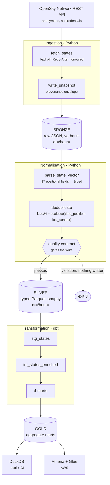

# Architecture

## The shape of it



## The one decision everything else follows from

**The same dbt models run on two engines.** `dbt-duckdb` locally and in CI,
`dbt-athena-community` in AWS. One model codebase, two profile targets, and not
a single `` in any model.

That constraint is what makes everything else possible. Because the
transformation layer runs on DuckDB over local Parquet, CI needs no AWS
account, no credentials and no spend — so the repository can be public, the
test suite can be exhaustive, and a contributor gets a green build in minutes.

It is also what makes the SQL uglier in places. Carrier codes are extracted
with `substr` and `BETWEEN 'A' AND 'Z'` character comparisons rather than one
clean regex, because DuckDB spells it `regexp_matches` and Trino spells it
`regexp_like`. That trade is deliberate and enforced: a test fails the build if
any model uses an engine-specific function or branches on the adapter.

Full reasoning, including what is *not* proven: [ADR 0001](adr/0001-duckdb-and-athena-dual-adapter.md).

## Layers

### Bronze — landing zone

Raw API responses, stored verbatim under a `payload` key, wrapped in a thin
provenance envelope:

```json
{
  "ingest": {
    "source": "opensky-live",
    "observed_at": "2026-08-25T09:46:05+00:00",
    "fetched_at":  "2026-08-25T09:46:15.448124+00:00",
    "state_count": 142
  },
  "payload": { "time": 1787651165, "states": [ ... ] }
}
```

A pure bronze layer would store the response byte-for-byte and nothing else.
The envelope exists because the build contract forbids passing fabricated
records off as real, and the only way to honour that downstream is to make the
distinction between observation and fixture replay **machine-readable rather
than a matter of trust**. `ingest_source` is carried all the way into silver.

**Partitioning uses `observed_at`, not the fetch time.** A snapshot fetched at
00:00:03 describing 23:59:58 belongs in the earlier hour. Using wall clock
would produce partitions that disagree with their own contents — a bug that is
invisible until someone queries a boundary hour and gets a quietly wrong
answer.

### Silver — the contract boundary

Typed, deduplicated Parquet. This is where the data stops being "whatever the
API returned" and starts being something downstream can rely on.

**Deduplication key: `(icao24, COALESCE(time_position, last_contact))`.** The
obvious key is `(icao24, time_position)`, but `time_position` is null for any
aircraft transmitting without a position fix, and a null key collapses every
such aircraft into one row. Those rows are kept, not dropped — no position fix
is still a real observation.

This matters because consecutive snapshots overlap heavily by design: in the
committed fixtures, captured 25 seconds apart, 139–143 of ~146 aircraft appear
in both. Deduplication is the difference between a table that grows with time
and one that grows with distinct observations.

**Quality contracts run *before* the write.** A violation exits `3` and leaves
nothing on disk. Checking afterwards would leave a bad batch for a downstream
reader to find first, which defeats the point of having a contract at this
boundary at all.

The distinction between violation and warning is deliberate: an aircraft with
no position fix is *incomplete*, which warns; one coordinate without the other
is *corrupt*, which fails. A check that fires on every real batch is a check
nobody reads.

### Gold — marts

Four aggregate tables, materialised as tables rather than views. On Athena a
view re-scans silver on every query, and bytes scanned is the only thing Athena
bills for.

| Mart | Grain |
| --- | --- |
| `mart_country_hourly_activity` | date · hour · country |
| `mart_altitude_band_distribution` | date · hour · altitude band |
| `mart_ground_activity_ratio` | date · hour · country |
| `mart_carrier_activity` | date · hour · carrier |

## Partitioning

**`dt` and `hour`. Not `origin_country`** — which reverses the original design,
after measurement showed ~7 rows per country partition. Small-file
fragmentation is what makes Athena slow and expensive, and Athena's 10 MB
minimum billing per query means pruning at this scale saves nothing at all.

The test for whether something should be a partition key is whether partition
count scales with **data volume** or with the cardinality of a categorical
field. Time scales with volume. Country does not.

[ADR 0003](adr/0003-partitioning-strategy.md) has the numbers.

## Catalog

Glue tables are **declared in Terraform**, never crawled. A crawler on an
hourly schedule costs an order of magnitude more than this project's entire
bill, to rediscover a schema that is already declared in `normalise.py` — and
it *infers* types rather than taking the ones we know, which is how a `squawk`
of `"0021"` becomes `21`.

Partitions use **projection** rather than a registered list, so a new hour
needs neither `MSCK REPAIR TABLE` nor an `ALTER TABLE` from something that has
to remember to run.

**Ownership is split and that split is deliberate:** Terraform owns the
database and the silver table; dbt owns the gold marts. Declaring gold in
Terraform too would put two systems in charge of the same resources — every
`dbt build` would drop tables Terraform believes it manages, and every
`terraform apply` would report drift it did not cause.

[ADR 0002](adr/0002-declarative-glue-tables-over-crawlers.md).

## What is deliberately absent

| Absent | Why |
| --- | --- |
| VPC / NAT Gateway | ~$32/month for the NAT alone. S3, Glue, Athena, Lambda and Step Functions are all VPC-free. |
| Glue crawlers | Per-DPU-hour with a 10-minute minimum, to rediscover a known schema. |
| Glue ETL / Spark | Spark to reshape a few hundred kilobytes is indefensible. |
| Redshift / OpenSearch / MWAA | Provisioned and billed hourly whether idle or not. |
| Long-lived AWS keys | GitHub OIDC exchanges a short-lived token for temporary credentials. There is no secret to leak, rotate or commit — which is why this repository can be public. |

## Trust boundaries

```
Public internet ──► OpenSky API          anonymous, read-only, no credential
                    │
Local / CI ─────────┤ no AWS credentials at any point
                    │ pytest severs outbound sockets
                    │ dbt runs on DuckDB over local Parquet
                    │
AWS ────────────────┤ GitHub OIDC, short-lived tokens only
                    │ role scoped to ONE repo at ONE ref (StringEquals)
                    │ S3 scoped to named prefixes, Glue to one database
                    │ Athena scoped to the workgroup carrying the cost ceiling
```

The Athena scoping is not incidental. A role able to query in *any* workgroup
could query in one without a bytes-scanned cutoff, which would make that cutoff
a convention rather than a control.

## Where the guarantees actually come from

Claims in a README are worth little; these are enforced by something that fails:

| Guarantee | Enforced by |
| --- | --- |
| Tests never touch the network | `conftest._no_network` severs `socket.connect` |
| No model branches on the adapter | `test_no_model_branches_on_the_adapter` |
| No engine-specific SQL | `test_no_model_uses_engine_specific_regex_functions` |
| No IAM resource wildcards | `test_no_policy_statement_uses_a_bare_resource_wildcard` |
| Trust policy is not widened | `test_trust_policy_pins_the_subject_with_string_equals` |
| CI cannot reach AWS | `test_no_workflow_can_obtain_aws_credentials` |
| Actions are SHA-pinned | `test_every_action_is_pinned_to_a_commit_sha` |
| Suppressions are justified | `test_every_checkov_suppression_carries_a_real_reason` (fails under 60 chars) |
| No secret reaches history | gitleaks pre-commit hook + weekly full-history scan |
